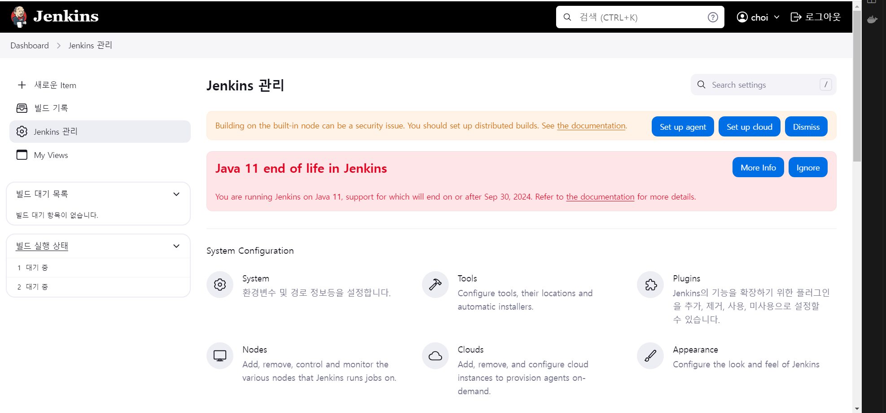
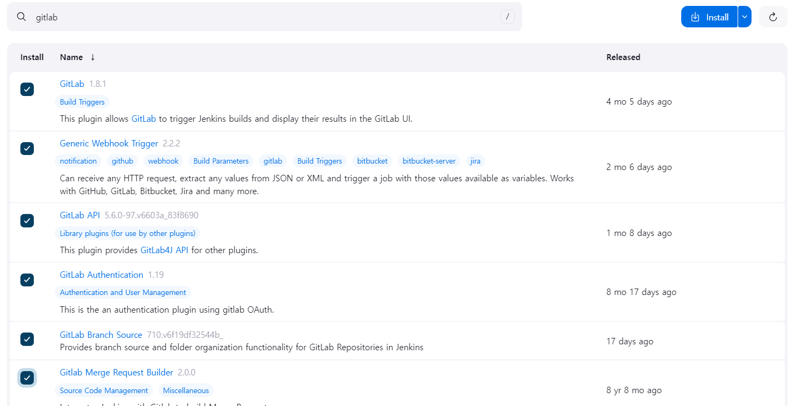

# Jenkins 
### AWS t2.xlarge(Linux) instance + gitlab 환경에서 진행
- 향후 github action과 비교 과정을 거쳐 장단점을 비교할 예정입니다.
### Jenkins LTS version 설치(native)
```
sudo wget -O /usr/share/keyrings/jenkins-keyring.asc \
  https://pkg.jenkins.io/debian-stable/jenkins.io-2023.key
echo "deb [signed-by=/usr/share/keyrings/jenkins-keyring.asc]" \
  https://pkg.jenkins.io/debian-stable binary/ | sudo tee \
  /etc/apt/sources.list.d/jenkins.list > /dev/null
sudo apt-get update
sudo apt-get install jenkins
```
#### Jenkins를 docker가 아닌 native로 띄운 이유.
- 보안 관리의 통제성, 직관성
- Jenkins는 jdk의 설치가 선행되어야하지만 native로 설치했을 때 커스터마이즈가 용이함.

### Jenkins Port 편집
```
sudo systemctl edit jenkins
[Service]
Environment="JENKINS_PORT=9090"
```
### Jenkins 실행
```
1. 시스템 재부팅시 실행
sudo systemctl enable jenkins
2. 실행
sudo systemctl start jenkins
```

### 방화벽
```
sudo ufw allow 9090/tcp
```

### Jenkins 초기 비밀번호 확인
```
sudo cat /var/lib/jenkins/secrets/initialAdminPassword
```

### 정상 설치(Java 11 end of life in Jenkins)
**아. Java 11 september 30 EOS...**


### Jenkins 플러그인 설치
gitlab과 관련된 모든 플러그인을 설치해주자!


### gitlab, Jenkins credential 설정
- Jenkins 메인 페이지 -> 왼쪽 사이드바 jenkins 관리-> Security -> credentials - Domains에 (global 클릭) Add Credentials ->
Kind(User with password), Scope(Global), Username(gitlab 이메일), password(gitlab Access Token) (발급 받는 방법은 하단부)

### gitlab personal access token
- gitlab 왼쪽 상단 본인 프로필 사진 -> Preferences -> 왼쪽 사이드바 Access Tokens -> Add new token -> 이름, 넉넉한 기간, 권한 체크(k8s 빼고 전부) -> Token 발급 -> 위의 password에 적용

### 파이프라인 credentials 적용 및 webhook 설정
- 소스코드 관리 Git -> gitlab repository URL -> credentials에 아까 입력한 정보의 credentials 선택, 적용할 branch 선택
-> 빌드 유발(build Trigger?) -> Build when a change is pushed to GitLab. GitLab webhook URL: 자동적용 되어있음 -> 
고급 -> 하단부 Secret Token Generate -> gitlab으로 이동

### gitlab webhook 설정
- gitlab 프로젝트 레포지토리 왼쪽 사이드바 settings -> Webhooks -> Add new webhook -> URL(아까 자동 적용된 URL 기입) -> Secret token(아까 jenkins 에서 발급받은 Token) -> Trigger에 적용하고싶은 Trigger 선택(Push, MR) Regular expression에
^(develop)/ -> SSL verification 선택 -> 생성 -> test


